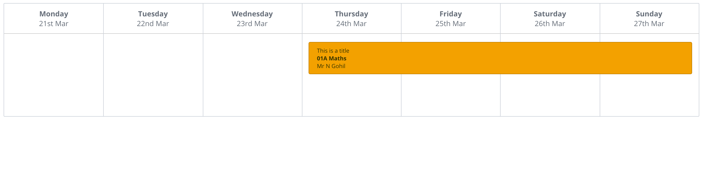

# SMHW Event Calendar

We ask candidates to undertake a small development exercise for us so they can demonstrate their technical prowess. In this instance, we want you to build a simple Rails application which comprises an events calendar. This application will consist of an `/events` page which displays a _weekly_ calendar highlighting the current date. Application users must be able to create an event which contains _start_ and _end date_ plus a _title_, _description_ and _teacher name_ fields.

Furthermore, the created event should instantly show on the calendar along with some indication as to when the event starts and finishes. Given this requirement, candidates should create an `EventsController` with these actions: `index`, `create`. Events should be saved in a backend store without refreshing the page.

This is an example of what we would like it to look like, however it doesn’t need to be pixel perfect.

Candidates may use any gems/plugins when building your solution. However, we will question candidates on their choices.

Please commit changes to git often with descriptive messages. These messages and the granularity of commits will be examined.

You should fork this project, and then when you have completed the work to your satisfaction, please raise a pull request for our attention.
